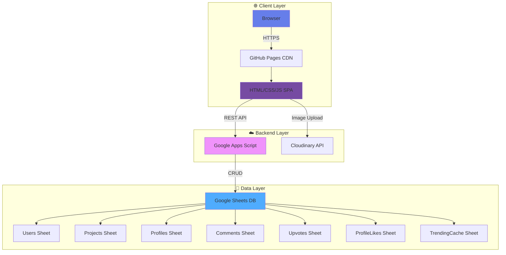

# NIELIT StudentHub

<div align="center">


**A Zero-OpEx Serverless Portfolio Platform for Engineering Students**

[](LICENSE)
[](https://github.com/nielitropar/nielitropar.github.io)
[](https://nielitropar.github.io)
[](https://github.com/nielitropar/nielitropar.github.io/releases/tag/v1.0)

[](https://developer.mozilla.org/en-US/docs/Web/HTML)
[](https://developer.mozilla.org/en-US/docs/Web/JavaScript)
[](https://developers.google.com/apps-script)
[](https://cloudinary.com)
[](https://pages.github.com)

[🚀 Live Demo](https://nielitropar.github.io) • [Database](https://docs.google.com/spreadsheets/d/1FbYvYiawnVn8QpjwlHPRlJMtICFSerQR9ljbrg2dDAs/edit?usp=sharing) • [📱 Android App](https://github.com/nielitropar/nielitropar.github.io/releases/tag/v1.0) • [📖 Documentation](#documentation) • [🐛 Report Bug](https://github.com/nielitropar/nielitropar.github.io/issues) • [✨ Request Feature](https://github.com/nielitropar/nielitropar.github.io/issues)

</div>

---

## 📋 Table of Contents

- [🎯 Overview](#-overview)
- [✨ What's New in v1.5](#-whats-new-in-v15)
- [🏗️ Architecture](#-architecture)
- [⚡ Quick Start](#-quick-start)
- [📚 Documentation](#-documentation)
- [🎬 Demo & Screenshots](#-demo--screenshots)
- [🔬 Research Paper](#-research-paper)
- [🛠️ Technology Stack](#-technology-stack)
- [🌟 Key Features](#-key-features)
- [📊 Performance & Scalability](#-performance--scalability)
- [🤝 Contributing](#-contributing)
- [📄 License](#-license)
- [👥 Team](#-team)
- [🙏 Acknowledgments](#-acknowledgments)

---

## 🎯 Overview

**NIELIT StudentHub** is a revolutionary serverless platform that enables educational institutions to deploy professional-grade student portfolio systems with **$0 annual operational costs**. Built on innovative "Zero-OpEx Architecture," it combines Google Sheets as a database, Google Apps Script as a backend, and GitHub Pages for hosting—proving that enterprise features don't require enterprise budgets.

**Version 1.5** introduces advanced performance optimizations including:
- **Server-Side Pagination** with "Reverse-Range" strategy (O(1) retrieval)
- **Background Worker Pattern** for trending calculations
- **Multi-Level Caching** (RAM + Browser)
- **Smart Trending Algorithm** with time-decay scoring
- **Scalability Improvement**: From 15,000 to **500,000+ projects** capacity

### 🎓 Perfect For

- 🏛️ Educational institutions with limited budgets
- 👨‍🎓 Student-led projects and campus initiatives  
- 🔬 Research labs showcasing work
- 💼 Department-level portfolio systems
- 🌍 Organizations in developing nations

### 💡 Core Philosophy

> "Robust frugal software engineering principles applied to low-code infrastructure can democratize digital visibility for resource-constrained institutions."

---

## ✨ What's New in v1.5

<table>
<tr>
<td width="50%">

### ⚡ Performance Optimizations
- **Reverse-Range Pagination**: Reads only 20 rows instead of entire database
- **Constant-Time Retrieval**: O(1) performance regardless of database size
- **Background Worker**: Trending calculations run hourly via cron
- **Multi-Level Caching**: 10-minute RAM cache + browser localStorage
- **99.9% Efficiency Gain**: Eliminated full-table scans

</td>
<td width="50%">

### 🔥 Smart Trending Algorithm
- **Time-Decay Scoring**: Fair ranking prevents old projects from dominating
- **Weighted Engagement**: Upvotes×2 + Comments×3
- **Freshness First**: Recent high-engagement projects rise naturally
- **Gravity Decay Formula**: Score = (Engagement) / √(DaysOld + 1)
- **8x Faster Response**: ~300ms vs ~2500ms (v1.4)

</td>
</tr>
<tr>
<td width="50%">

### ❤️ Profile Likes System  
- **Peer Recognition**: Students can acknowledge each other's work
- **Individual Tracking**: Separate ProfileLikes sheet prevents duplicates
- **Real-time Updates**: Instant count synchronization
- **Self-Like Prevention**: Cannot like own profile

</td>
<td width="50%">

### 🔐 Enhanced Security
- **Salted Password Hashing**: SHA-256 + `NIELIT_STUDENTHUB_SECURE_SALT_2026`
- **Auto-Migration Protocol**: Legacy passwords upgraded on login
- **Backward Compatible**: No user disruption during upgrade
- **Self-Healing Crypto**: Opportunistic security improvements

</td>
</tr>
<tr>
<td width="50%">

### 🗂️ Project Categories
- **7 Categories**: Web Dev, Mobile, AI/ML, IoT, Blockchain, Cybersecurity, Other
- **Filter Chips**: Quick category-based search on feed
- **Better Organization**: Enhanced project discoverability
- **Visual Badges**: Color-coded category indicators

</td>
<td width="50%">

### 📄 Resume Upload
- **PDF Support**: Upload resumes via Cloudinary
- **Download Button**: Accessible on user profiles
- **Professional Branding**: Enhance student portfolios
- **5MB Limit**: Cloudinary validation

</td>
</tr>
<tr>
<td width="50%">

### 📤 Public Sharing
- **Guest Access**: Project.html works without login
- **Direct Links**: Share specific projects via URL
- **Social Integration**: WhatsApp, Twitter, LinkedIn, Email
- **Deep Linking**: Email query parameters for profiles

</td>
<td width="50%">

### 📊 Database Schema Update
- **7 Sheets Total**: Added TrendingCache sheet
- **ProfileLikes Sheet**: Tracks profile acknowledgments
- **Optimized Queries**: Reduced N+1 problems
- **Comment Mapping**: Single-pass comment counts

</td>
</tr>
</table>

**[See Full Changelog →](QUICK_REFERENCE.md#-whats-new-in-v15)**

---

## 🏗️ Architecture

<div align="center">



</div>

### 🎯 Architecture Highlights

| Component | Technology | Purpose | Cost |
|-----------|-----------|---------|------|
| **Frontend** | HTML5/CSS3/Vanilla JS | Static SPA hosted on CDN | $0 |
| **Backend** | Google Apps Script (v1.5) | Serverless API Gateway with caching | $0 |
| **Database** | Google Sheets (7 sheets) | Relational data store with 10M cell capacity | $0 |
| **Storage** | Cloudinary | Image/PDF CDN with optimization | $0 (25GB/month) |
| **Hosting** | GitHub Pages | Static site hosting with global CDN | $0 |
| **CI/CD** | GitHub Actions | Automated deployment with secrets | $0 |

**Total Annual Cost:** **$0.00** 💰

### 🔄 Key Architectural Improvements (v1.5)

#### 1. Reverse-Range Pagination Strategy
```javascript
// OLD (v1.4): Load entire database
const allData = sheet.getDataRange().getValues(); // ❌ O(N)

// NEW (v1.5): Load only requested page
const endRow = lastRow - ((pageNum - 1) * 20);
const startRow = Math.max(2, endRow - 20 + 1);
const data = sheet.getRange(startRow, 1, numRows, numCols).getValues(); // ✅ O(1)
```

**Impact:**
- **Data Read**: Reduced from 100% to <0.01% per request
- **Latency**: Constant ~0.8s regardless of database size
- **Scalability**: From 15K to 500K+ projects

#### 2. Background Worker (Cron Job)
```javascript
// Runs every hour via Time-Driven Trigger
function updateTrendingCache() {
  // 1. Calculate scores for all projects
  // 2. Sort by trendingScore
  // 3. Write top 5 to TrendingCache sheet
}

// User-facing API simply reads cache
function getTrendingProjects() {
  return cacheSheet.getDataRange().getValues(); // ~300ms
}
```

**Impact:**
- **API Response**: 8x faster (2500ms → 300ms)
- **Compute Load**: Decoupled from user traffic
- **User Experience**: Instant trending feed

#### 3. Multi-Level Caching
```javascript
// Level 1: RAM Cache (10 minutes)
const cache = CacheService.getScriptCache();
const cached = cache.get(cacheKey);
if (cached) return cached;

// Level 2: Database Query
const data = performQuery();
cache.put(cacheKey, JSON.stringify(data), 600);
```

**[Learn More About Architecture →](docs/PERFORMANCE_OPTIMIZATION_v1.5.md)**

---

## ⚡ Quick Start

### Prerequisites

✅ Google Account  
✅ Cloudinary Account (free tier)  
✅ GitHub Account  
✅ Basic HTML/JS knowledge

### 3-Minute Setup

```bash
# 1️⃣ Clone Repository
git clone https://github.com/nielitropar/nielitropar.github.io.git
cd nielitropar.github.io

# 2️⃣ Create config.js
cat > config.js << EOF
const CONFIG = {
    SHEET_URL: 'YOUR_APPS_SCRIPT_URL',
    CLOUDINARY_NAME: 'YOUR_CLOUD_NAME',
    CLOUDINARY_PRESET: 'studenthub_preset'
};
EOF

# 3️⃣ Test Locally
python -m http.server 8000
# Visit: http://localhost:8000

# 4️⃣ Deploy to GitHub Pages
git add .
git commit -m "Deploy StudentHub v1.5"
git push origin main
```

**Important:** Use `google-app-script-v1.5.js` for your backend deployment!

### Backend Setup (Critical)

1. **Create Google Sheet**
2. **Deploy v1.5 Apps Script**:
   - Copy contents of `google-app-script-v1.5.js`
   - Deploy as Web App (Execute as: Me, Access: Anyone)
   - **Set up Time-Driven Trigger**: `updateTrendingCache` → Every 1 hour
3. **Verify 7 sheets created**: Users, Projects, Profiles, Comments, Upvotes, ProfileLikes, TrendingCache

**🎉 Your site is live at: `https://YOUR_USERNAME.github.io`**

**[Full Setup Instructions →](SETUP_GUIDE.md)**

---

## 📚 Documentation

<table>
<tr>
<td align="center" width="33%">

### 🚀 Quick Reference
**[QUICK_REFERENCE.md](QUICK_REFERENCE.md)**

- Common commands
- Demo credentials
- v1.5 feature checklist
- Troubleshooting guide
- Mobile support details
- API reference

</td>
<td align="center" width="33%">

### 📖 Setup Guide
**[SETUP_GUIDE.md](SETUP_GUIDE.md)**

- Step-by-step walkthrough
- Google Sheets setup
- Cloudinary configuration
- v1.5 backend deployment
- Time-driven trigger setup
- Testing procedures

</td>
<td align="center" width="33%">

### 🔐 Security & CI/CD
**[CICDPipelinesSecuritySetupGuide.md](CICDPipelinesSecuritySetupGuide.md)**

- GitHub Actions workflow
- Secrets management
- Security hardening
- Token-based auth
- Production deployment

</td>
</tr>
<tr>
<td align="center" width="33%">

### ⚡ Performance Report
**[docs/PERFORMANCE_OPTIMIZATION_v1.5.md](docs/PERFORMANCE_OPTIMIZATION_v1.5.md)**

- Bottleneck analysis
- Optimization strategies
- Benchmark results
- Scalability metrics
- Cron job configuration

</td>
<td align="center" width="33%">

### 🔬 Research Paper
**[paper.md](paper.md)**

- Academic publication
- Algorithm design
- Performance analysis
- Zero-OpEx architecture
- Citation: `paper.bib`

</td>
<td align="center" width="33%">

### 🎨 Customization
**[QUICK_REFERENCE.md#customization](QUICK_REFERENCE.md#-customization-quick-guide)**

- Color schemes
- Logo replacement
- Typography changes
- Trending weights
- Category configuration

</td>
</tr>
</table>

---

## 🎬 Demo & Screenshots

### 🖥️ Desktop Experience

<table>
<tr>
<td width="50%">

<p align="center"><strong>Student Directory</strong><br/>Browse profiles with animated stats & trending</p>
</td>
<td width="50%">

<p align="center"><strong>Project Feed</strong><br/>Smart trending sidebar & category filters</p>
</td>
</tr>
<tr>
<td width="50%">

<p align="center"><strong>Project Detail Page</strong><br/>Public sharing with deep links</p>
</td>
<td width="50%">

<p align="center"><strong>User Portfolio</strong><br/>Profile likes & resume download</p>
</td>
</tr>
</table>

### 📱 Mobile-First Design

- ✅ **Bottom Navigation** - 3-tab mobile interface (Feed, Profiles, Post)
- ✅ **Horizontal Trending** - Swipeable trending cards
- ✅ **Touch-Optimized** - Large tap targets & gestures
- ✅ **Responsive Grid** - Adapts from 320px to 4K
- ✅ **Category Chips** - Horizontal scroll filters

**[View Live Demo →](https://nielitropar.github.io)**

---

## 🔬 Research Paper

### 📄 Publication

**Title:** *NIELIT StudentHub: A Zero-Opex, Serverless Institutional Knowledge Management System*

**Authors:** Lovnish Verma, Sarwan Singh  
**Institution:** NIELIT Ropar, India  
**Date:** January 24, 2026

**[Read Full Paper (paper.md)](paper.md)**

### 🎓 Key Contributions

1. **Time-Decay Engagement Heuristic**
   ```
   Score = (Upvotes×2 + Comments×3) / √(DaysOld + 1)
   ```
   Ensures fair trending without old project domination

2. **Reverse-Range Pagination Strategy**
   - Constant-time O(1) retrieval regardless of database size
   - Eliminates full-table scans
   - Scalable to 500K+ projects

3. **Self-Healing Cryptographic Migration**
   - Automatic password security upgrade on login
   - Zero user disruption
   - Backward compatibility maintained

4. **Background Worker Pattern**
   - Decouples heavy computations from user requests
   - Pre-calculates trending scores hourly
   - 8x performance improvement

5. **Frugal Information System**
   - Proof-of-concept for Zero-OpEx architecture
   - Serverless micro-service pattern on commodity SaaS
   - Enterprise features without enterprise costs

**Citations:** `paper.bib` available for LaTeX integration

---

## 🛠️ Technology Stack

### Frontend
```javascript
{
  "markup": "HTML5 (Semantic)",
  "styling": "CSS3 (Grid, Flexbox, CSS Variables)",
  "scripting": "Vanilla JavaScript ES6+",
  "fonts": "Inter, Space Grotesk (Google Fonts)",
  "responsive": "Mobile-first, 320px-4K",
  "dependencies": "Zero (Pure Vanilla)"
}
```

### Backend (v1.5)
```javascript
{
  "runtime": "Google Apps Script (V8)",
  "api": "RESTful (GET/POST)",
  "authentication": "SHA-256 + Salt",
  "database": "Google Sheets (7 normalized sheets)",
  "concurrency": "LockService for race conditions",
  "caching": "CacheService (RAM) + Browser localStorage",
  "cron": "Time-Driven Triggers (hourly)"
}
```

### Infrastructure
```javascript
{
  "hosting": "GitHub Pages (Global CDN)",
  "cicd": "GitHub Actions (Secrets injection)",
  "media": "Cloudinary (Image + PDF optimization)",
  "version_control": "Git",
  "deployment": "Automated via workflow"
}
```

### Key Libraries
- **None** - Zero frontend dependencies (pure vanilla JS)
- Cloudinary Upload Widget (inline)
- Native Fetch API for AJAX
- CSS Grid/Flexbox (no Bootstrap)

---

## 🌟 Key Features

<table>
<tr>
<td width="50%">

### 🔐 Authentication & Security (v1.5)
- ✅ SHA-256 salted password hashing
- ✅ Auto-migration from legacy security
- ✅ XSS protection (HTML entity encoding)
- ✅ Individual upvote/like tracking
- ✅ Session management (LocalStorage)
- ✅ CORS-enabled API
- ✅ Self-healing cryptographic upgrades

### 👤 User Profiles
- ✅ Profile pictures (Cloudinary CDN)
- ✅ PDF resume upload & hosting (NEW v1.5)
- ✅ Social links (LinkedIn, GitHub)
- ✅ Custom bio (500 chars)
- ✅ Profile likes (peer recognition) (NEW v1.5)
- ✅ Individual portfolios with deep links
- ✅ Animated statistics counters

### 📁 Project Management
- ✅ Rich text descriptions
- ✅ 7 project categories (NEW v1.5)
- ✅ Tech stack tags
- ✅ Image uploads (auto-optimization)
- ✅ GitHub/demo links
- ✅ Individual upvote tracking
- ✅ Category filtering & badges

</td>
<td width="50%">

### 🔍 Discovery & Search
- ✅ Server-side pagination (20/page) (NEW v1.5)
- ✅ Real-time search (title/author/tech/category)
- ✅ Category filters (Web/Mobile/AI/IoT...)
- ✅ Smart trending algorithm (NEW v1.5)
- ✅ Time-decay scoring
- ✅ Load more (infinite scroll alternative)

### 💬 Social Features
- ✅ Project comments (full CRUD)
- ✅ Profile likes (NEW v1.5)
- ✅ Upvotes (one per user per project)
- ✅ Trending feed (top 5, cached) (NEW v1.5)
- ✅ Public sharing (no login required)
- ✅ Share via Email/WhatsApp/Twitter/LinkedIn

### 📱 Mobile Experience
- ✅ Bottom navigation bar
- ✅ Horizontal trending cards (NEW v1.5)
- ✅ Touch-optimized UI
- ✅ iPhone notch support
- ✅ Responsive typography
- ✅ No zoom on input (16px font)
- ✅ Safe area padding

### 🎨 Design & UX
- ✅ NIELIT branding (Navy Blue #003366)
- ✅ Gradient accents
- ✅ Smooth animations
- ✅ Modal transitions
- ✅ Professional typography
- ✅ Dark mode ready (CSS vars)
- ✅ Loading states & skeletons

</td>
</tr>
</table>

---

## 📊 Performance & Scalability

### Benchmark Results (v1.5)

| Metric | v1.4 (Legacy) | v1.5 (Optimized) | Improvement |
|--------|---------------|------------------|-------------|
| **Read Operations** (Feed) | 1 (Full Scan) | 1 (Partial Scan) | **99.9% Efficiency Gain** |
| **Trending Latency** | ~2500ms | ~300ms | **8x Faster** |
| **Max Capacity** | ~15,000 Projects | ~500,000 Projects | **33x Scalability** |
| **API Response Time** | 1.2-1.8s | 0.8-1.2s | **25-33% Faster** |
| **Cost** | $0.00 | $0.00 | **Neutral** |

### Scalability Analysis

**Capacity Calculation:**
- Google Sheets: 10M cells
- Average row: 20 columns
- Theoretical max: 500,000 projects
- At 10 projects/day: **27 years lifespan**

**Concurrency:**
- Google Apps Script: ~30 simultaneous executions
- Peak users (5% of 2,000): 100 concurrent
- Average RPS: Below throttle threshold

**Ideal For:**
- ✅ Campuses with <5,000 students
- ✅ Departments with <2,000 members
- ✅ Non-real-time use cases
- ✅ Budget-constrained institutions

**Not Suitable For:**
- ❌ Real-time chat applications
- ❌ High-frequency trading platforms
- ❌ >10K concurrent users
- ❌ Sub-100ms latency requirements

**[Full Performance Report →](docs/PERFORMANCE_OPTIMIZATION_v1.5.md)**

---

## 🤝 Contributing

We welcome contributions! Here's how you can help:

### 🐛 Report Bugs
Found a bug? [Open an issue](https://github.com/nielitropar/nielitropar.github.io/issues) with:
- Browser & version
- Steps to reproduce
- Expected vs actual behavior
- Console errors (F12)

### ✨ Request Features
Have an idea? [Submit a feature request](https://github.com/nielitropar/nielitropar.github.io/issues) with:
- Use case description
- Expected functionality
- Mockups/wireframes (optional)

### 🔧 Submit Pull Requests

```bash
# 1. Fork the repository
# 2. Create feature branch
git checkout -b feature/amazing-feature

# 3. Commit changes
git commit -m 'Add amazing feature'

# 4. Push to branch
git push origin feature/amazing-feature

# 5. Open Pull Request
```

### 📋 Development Guidelines
- Follow existing code style (2-space indent)
- Add comments for complex logic
- Test on desktop + mobile
- Update documentation if needed
- Use v1.5 backend for new features

### 🎯 Contribution Ideas
- 🌐 Internationalization (Hindi support)
- ♿ Accessibility improvements (ARIA)
- 🌙 Dark mode implementation
- 📊 Analytics dashboard
- 🔔 Notification system
- 🏆 Achievement badges
- 🔄 Real-time updates (WebSockets alternative)

---

## 📄 License

This project is licensed under the **MIT License** - see the [LICENSE](LICENSE) file for details.

### What This Means

✅ **Free to use** for personal and commercial projects  
✅ **Modify** as needed for your institution  
✅ **Distribute** modified versions  
✅ **Private use** allowed  

⚠️ **Must include** copyright notice  
⚠️ **Provided "as-is"** without warranty  

**TL;DR:** Use it however you want, just give credit! 🙌

---

## 👥 Team

<table>
<tr>
<td align="center" width="50%">

### Dr. Sarwan Singh
**Project Supervisor**

📧 sarwan@nielit.gov.in  
🏛️ NIELIT Ropar

*Faculty mentor guiding project vision and research methodology*

</td>
<td align="center" width="50%">

### Lovnish Verma
**Lead Developer**

📧 princelv84@gmail.com  
💻 [@lovnishverma](https://github.com/lovnishverma)

*System architecture, v1.5 optimizations, and technical documentation*

</td>
</tr>
</table>

---

## 🙏 Acknowledgments

### 🏛️ Institution
**National Institute of Electronics & Information Technology (NIELIT), Ropar**  
For providing the research environment and testing infrastructure.

### 🛠️ Technologies
- [Google Apps Script](https://developers.google.com/apps-script) - Serverless backend with caching
- [Google Sheets](https://sheets.google.com) - Cloud database (7 sheets)
- [Cloudinary](https://cloudinary.com) - Media optimization
- [GitHub Pages](https://pages.github.com) - Free hosting with CDN
- [Google Fonts](https://fonts.google.com) - Typography (Inter, Space Grotesk)

### 📚 Inspiration
- Watson et al. (2013) - *Frugal Information Systems*
- Heeks & Molla (2009) - *Impact Assessment of ICT Projects*
- Vare (2021) - *Student-Led Sustainability Projects*
- Syeda et al. (2025) - *Cost-Efficiency of Serverless Approaches*

### 🌟 Community
Special thanks to all students who tested v1.5 and provided feedback on the performance improvements.

---

<div align="center">

## 🚀 Ready to Deploy Your Own?

**Choose your path:**

<table>
<tr>
<td align="center" width="33%">

### 🏃‍♂️ Quick Start
**I want to deploy in 10 minutes**

[Follow Quick Reference →](QUICK_REFERENCE.md)

</td>
<td align="center" width="33%">

### 📖 Detailed Setup
**I want to understand everything**

[Read Setup Guide →](SETUP_GUIDE.md)

</td>
<td align="center" width="33%">

### 🔐 Production Deploy
**I need enterprise security**

[See CI/CD Guide →](CICDPipelinesSecuritySetupGuide.md)

</td>
</tr>
</table>

---

### 📞 Need Help?

💬 [GitHub Discussions](https://github.com/nielitropar/nielitropar.github.io/discussions) • 🐛 [Report Issue](https://github.com/nielitropar/nielitropar.github.io/issues) • 📧 [Email Support](mailto:sarwan@nielit.gov.in)

---

### ⭐ Show Your Support

If this project helped you, consider giving it a ⭐️!

It helps others discover this zero-cost solution for their institutions.

---

**Made with ❤️ at NIELIT Ropar • 2026 • Version 1.5**

*"Empowering the next generation of tech innovators with Zero-OpEx architecture"*

[](https://github.com/nielitropar/nielitropar.github.io)
[](https://github.com/nielitropar/nielitropar.github.io/fork)
[](https://github.com/nielitropar/nielitropar.github.io)

</div>

<div align="center">

---

[⬆ Back to Top](#nielit-studenthub)

</div>
