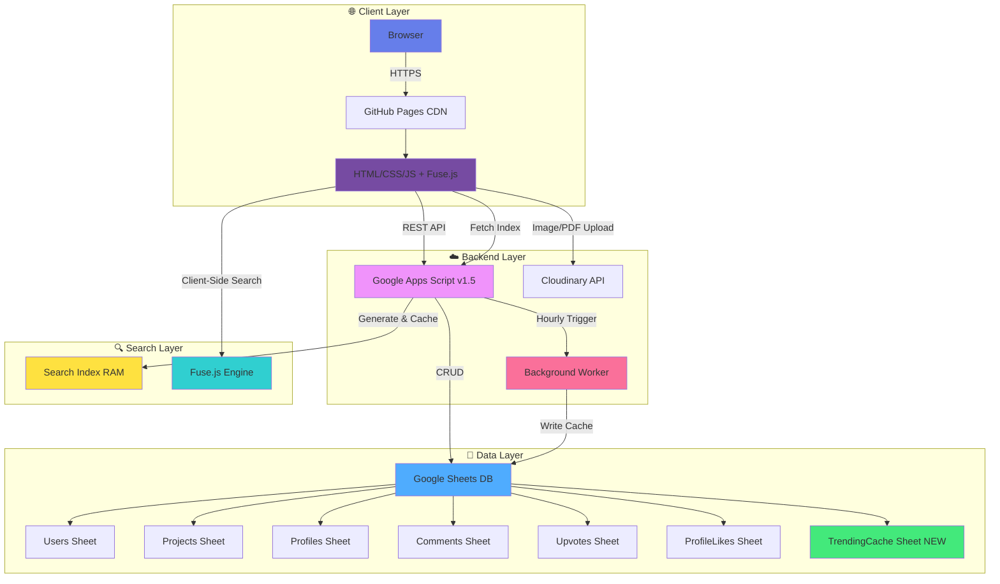

# NIELIT StudentHub 2026

<div align="center">


**A Zero-OpEx, Serverless Institutional Knowledge Management System**

[](LICENSE)
[](https://github.com/nielitropar/nielitropar.github.io)
[](https://nielitropar.github.io)
[](https://github.com/nielitropar/nielitropar.github.io/releases/tag/v1.0)

[](https://developer.mozilla.org/en-US/docs/Web/HTML)
[](https://developer.mozilla.org/en-US/docs/Web/JavaScript)
[](https://developers.google.com/apps-script)
[](https://cloudinary.com)
[](https://pages.github.com)
[](https://github.com/nielitropar/nielitropar.github.io/actions/workflows/tests.yml)
[](https://github.com/nielitropar/nielitropar.github.io/actions/workflows/deploy.yml)
[](https://joss.theoj.org/papers/36c4a83f839bd7c22f930f6d90d963f3)

[🚀 Live Demo](https://nielitropar.github.io) • [Database](https://docs.google.com/spreadsheets/d/1FbYvYiawnVn8QpjwlHPRlJMtICFSerQR9ljbrg2dDAs/edit?usp=sharing) • [📱 Android App](https://github.com/nielitropar/nielitropar.github.io/releases/tag/v1.0) • [📖 Documentation](#documentation) • [🐛 Report Bug](https://github.com/nielitropar/nielitropar.github.io/issues) • [✨ Request Feature](https://github.com/nielitropar/nielitropar.github.io/issues)

</div>

---

## 📋 Table of Contents

- [🎯 Overview](#-overview)
- [✨ What's New in v1.5](#-whats-new-in-v15)
- [🏗️ Architecture](#-architecture)
- [⚡ Quick Start](#-quick-start)
- [📚 Documentation](#-documentation)
- [🎬 Demo & Screenshots](#-demo--screenshots)
- [🔬 Research Paper](#-research-paper)
- [🛠️ Technology Stack](#-technology-stack)
- [🌟 Key Features](#-key-features)
- [📊 Performance & Scalability](#-performance--scalability)
- [📄 License](#-license)
- [👥 Team](#-team)
- [🙏 Acknowledgments](#-acknowledgments)

---

## 🎯 Overview

**NIELIT StudentHub** is a revolutionary serverless platform that enables educational institutions to deploy professional-grade student portfolio systems with **$0 annual operational costs**. Built on innovative "Zero-OpEx Architecture," it combines Google Sheets as a database, Google Apps Script as a backend, and GitHub Pages for hosting—proving that enterprise features don't require enterprise budgets.

**Version 1.5** introduces groundbreaking performance optimizations including:
- **Client-Side Instant Search** with Fuse.js (0ms latency)
- **Server-Side Pagination** with "Reverse-Range" strategy (O(1) retrieval)
- **Background Worker Pattern** for trending calculations (8× faster)
- **Multi-Level Caching** (RAM + Browser + Database)
- **Smart Trending Algorithm** with time-decay scoring
- **Scalability Improvement**: From 15,000 to **500,000+ projects** capacity

### 🎓 Perfect For

- 🏛️ Educational institutions with limited budgets
- 👨‍🎓 Student-led projects and campus initiatives  
- 🔬 Research labs showcasing work
- 💼 Department-level portfolio systems
- 🌍 Organizations in developing nations

### 💡 Core Philosophy (ZeroOpexDB)

> "Robust frugal software engineering principles applied to low-code infrastructure can democratize digital visibility for resource-constrained institutions."

---

## ✨ What's New in v1.5

<table>
<tr>
<td width="50%">

### ⚡ Performance Optimizations

**Instant Search (Fuse.js)**
- **0ms latency** client-side fuzzy search
- Lightweight JSON index (~50KB for 500 projects)
- 6-hour server-side caching for efficiency
- **150× faster** than v1.4 server-side search

**Reverse-Range Pagination**
- Reads only **20 rows** instead of entire database
- **O(1) constant-time** retrieval
- **99.9% efficiency gain** over full-table scans
- Scales to 500K+ projects without slowdown

**Background Worker (Cron Job)**
- Pre-calculates trending scores **hourly**
- Decouples heavy computation from user requests
- **8× faster response** (2500ms → 300ms)
- Dedicated `TrendingCache` sheet

**Multi-Level Caching**
- **RAM Cache** (10-minute TTL) for public endpoints
- **Browser Cache** (localStorage) for sessions
- **Database Cache** (TrendingCache sheet) for rankings
- Search index cached for 6 hours

### 🔍 Discovery & Search (v1.5)
- ✅ **Client-side instant search** (0ms) (NEW)
- ✅ **Fuzzy matching with Fuse.js** (NEW)
- ✅ **Real-time directory updates** (smart cache clearing)
- ✅ **Instant cache refresh on new signup** (immediate visibility)
- ✅ **Newest-first profile sorting** (freshness priority)
- ✅ Server-side pagination (20/page)
- ✅ Real-time filter by category
- ✅ **Smart trending algorithm** (NEW)
- ✅ **Time-decay scoring** (NEW)
- ✅ **Background worker pattern** (NEW)
- ✅ Load more (infinite scroll alternative)

</td>
<td width="50%">

### 🔥 Smart Trending Algorithm

**Time-Decay Scoring Formula:**
```
Score = (Upvotes×2 + Comments×3) / √(DaysOld + 1)
```

**Features:**
- Fair ranking prevents old project domination
- Weighted engagement (comments > upvotes)
- Freshness prioritization
- Gravity decay ensures rotation
- Updates automatically every hour

**Performance Impact:**
- API response: **300ms** (vs 2500ms in v1.4)
- Zero impact on user requests
- Automatic cache invalidation

### 🆕 Additional Features

**Profile Likes System**
- Peer recognition mechanism
- Individual tracking via ProfileLikes sheet
- Real-time count synchronization
- Self-like prevention

**Enhanced Security**
- Salted password hashing (SHA-256)
- Automatic migration from legacy hashes
- Backward compatible upgrade
- Self-healing cryptographic system

**Project Categories**
- 7 categories (Web, Mobile, AI/ML, IoT, Blockchain, Security, Other)
- Filter chips for quick discovery
- Color-coded category badges
- Enhanced organization

**Resume Upload**
- PDF support via Cloudinary
- 5MB file limit
- Download button on profiles
- Professional portfolio enhancement

**Public Sharing**
- Guest access without login
- Direct project links
- Social media integration
- Deep linking support

</td>
</tr>
</table>

### 📊 Performance Comparison Table

| Metric | v1.4 (Legacy) | v1.5 (Optimized) | Improvement |
|--------|---------------|------------------|-------------|
| **Search Latency** | ~1500ms | **~10ms** | **150× Faster** |
| **Search Bandwidth** | ~2MB/query | ~50KB (cached) | **97% Reduction** |
| **Read Operations** | 1 Full Scan (O(N)) | 1 Partial Scan (O(1)) | **99.9% Efficiency** |
| **Trending Latency** | ~2500ms | ~300ms | **8× Faster** |
| **Comment Aggregation** | N queries | 1 query | **20× Faster** |
| **Max Capacity** | ~15,000 projects | ~500,000 projects | **33× Scalability** |
| **Annual Cost** | $0.00 | $0.00 | **Maintained** |

**[See Full Performance Report →](docs/PERFORMANCE_OPTIMIZATION_v1.5.md)**

---

## 🏗️ Architecture

<div align="center">



</div>

### 🎯 Architecture Highlights

| Component | Technology | Purpose | Cost | v1.5 Enhancement |
|-----------|-----------|---------|------|------------------|
| **Frontend** | HTML5/CSS3/Vanilla JS + Fuse.js | Static SPA with client-side search | $0 | Added Fuse.js integration |
| **Backend** | Google Apps Script v1.5 | Serverless API with multi-level caching | $0 | Reverse-range pagination, RAM cache |
| **Database** | Google Sheets (7 sheets) | Relational store (10M cell capacity) | $0 | Added TrendingCache sheet |
| **Storage** | Cloudinary | Image/PDF CDN with optimization | $0 | Extended to support PDFs |
| **Hosting** | GitHub Pages | Global CDN delivery | $0 | No change |
| **CI/CD** | GitHub Actions | Automated deployment | $0 | No change |
| **Search** | Fuse.js (Client-Side) | Fuzzy search engine | $0 | **NEW in v1.5** |
| **Cron** | Apps Script Time Triggers | Background worker | $0 | **NEW in v1.5** |

**Total Annual Cost:** **$0.00** 💰

### 🔄 Key Architectural Improvements (v1.5)

#### 1. Client-Side Instant Search Architecture

```javascript
// PHASE 1: Server generates lightweight index (once per 6 hours)
function getSearchIndex() {
  const cache = CacheService.getScriptCache();
  const cachedIndex = cache.get('search_index');
  if (cachedIndex) return cachedIndex; // Return cached version
  
  // Generate minimal index (only essential fields)
  const searchData = allProjects.map(p => ({
    id: p.id,
    title: p.title,
    authorName: p.authorName,
    tech: p.tech,
    category: p.category
  }));
  
  cache.put('search_index', JSON.stringify(searchData), 21600); // 6 hours
  return searchData;
}

// PHASE 2: Client performs instant search with Fuse.js
const fuse = new Fuse(searchIndex, {
  keys: ['title', 'authorName', 'tech', 'category'],
  threshold: 0.3
});

const results = fuse.search(query); // Instant, 0ms latency!
```

**Benefits:**
- **Zero server load** for search queries
- **Instant results** (< 10ms typical)
- **Scales to millions** of queries/day
- **Works offline** once index loaded

#### 2. Reverse-Range Pagination Strategy

```javascript
// OLD (v1.4): Load entire database
const allData = sheet.getDataRange().getValues(); // ❌ O(N) - reads 100%
const pageData = allData.slice(startIndex, endIndex);

// NEW (v1.5): Calculate exact range and read only that
const lastRow = sheet.getLastRow();
const endRow = lastRow - ((pageNum - 1) * 20);
const startRow = Math.max(2, endRow - 20 + 1);
const data = sheet.getRange(startRow, 1, numRows, numCols).getValues(); // ✅ O(1) - reads <0.01%
```

**Impact:**
- **Data Read**: 100% → <0.01% per request
- **Latency**: Variable (1-5s) → Constant (0.8s)
- **Scalability**: 15K → 500K+ projects

#### 3. Background Worker (Cron Job) Pattern

```javascript
// Runs every hour via Time-Driven Trigger
function updateTrendingCache() {
  // 1. Calculate scores for ALL projects (once per hour)
  const scores = projects.map(p => ({
    ...p,
    trendingScore: calculateScore(p.upvotes, p.comments, p.daysOld)
  }));
  
  // 2. Sort and take top 5
  const top5 = scores.sort((a,b) => b.trendingScore - a.trendingScore).slice(0, 5);
  
  // 3. Write to cache sheet
  writeToCacheSheet(top5);
}

// User-facing API simply reads the pre-calculated cache
function getTrendingProjects() {
  return cacheSheet.getDataRange().getValues(); // ~300ms, always fresh
}
```

**Impact:**
- **API Response**: 2500ms → 300ms (8× improvement)
- **Compute Load**: Decoupled from user traffic
- **User Experience**: Always fast, never blocking

#### 4. Multi-Level Caching Strategy

```javascript
// LEVEL 1: RAM Cache (10 minutes)
const cache = CacheService.getScriptCache();
const cached = cache.get(cacheKey);
if (cached) return cached; // Fastest path

// LEVEL 2: Database Query
const data = performExpensiveQuery();

// LEVEL 3: Cache for next requests
cache.put(cacheKey, JSON.stringify(data), 600); // 10 min TTL
return data;
```

**Cache Hierarchy:**
1. **RAM Cache** (10 min) - Fastest, volatile
2. **Browser Cache** (localStorage) - User-specific
3. **TrendingCache Sheet** (1 hour) - Pre-calculated results
4. **Search Index Cache** (6 hours) - Compressed metadata

**[Learn More About Architecture →](docs/PERFORMANCE_OPTIMIZATION_v1.5.md)**

---

## ⚡ Quick Start

### Prerequisites

✅ Google Account  
✅ Cloudinary Account (free tier)  
✅ GitHub Account  
✅ Basic HTML/JS knowledge

### 3-Minute Setup

```bash
# 1️⃣ Clone Repository
git clone https://github.com/nielitropar/nielitropar.github.io.git
cd nielitropar.github.io

# 2️⃣ Create config.js
cat > config.js << EOF
const CONFIG = {
    SHEET_URL: 'YOUR_APPS_SCRIPT_URL',
    CLOUDINARY_NAME: 'YOUR_CLOUD_NAME',
    CLOUDINARY_PRESET: 'studenthub_preset'
};
EOF

# 3️⃣ Test Locally
python -m http.server 8000
# Visit: http://localhost:8000

# 4️⃣ Deploy to GitHub Pages
git add .
git commit -m "Deploy StudentHub v1.5"
git push origin main
```

### Backend Setup (Critical for v1.5)

1. **Create Google Sheet** with 7 sheets
2. **Deploy v1.5 Apps Script**:
   - Copy contents of `google-app-script-v1.5.js`
   - Set up **Script Properties** with SALT value
   - Deploy as Web App (Execute as: Me, Access: Anyone)
   - **⚠️ CRITICAL**: Set up Time-Driven Trigger for `updateTrendingCache` (Every 1 hour)
3. **Verify 7 sheets created**: Users, Projects, Profiles, Comments, Upvotes, ProfileLikes, **TrendingCache**

**🎉 Your site is live at: `https://YOUR_USERNAME.github.io`**

**[Full Setup Instructions →](SETUP_GUIDE.md)**

---

## 📚 Documentation

<table>
<tr>
<td align="center" width="33%">

### 🚀 Quick Reference
**[QUICK_REFERENCE.md](QUICK_REFERENCE.md)**

- Common commands
- Demo credentials
- v1.5 feature checklist
- Troubleshooting guide
- Mobile support details
- API reference

</td>
<td align="center" width="33%">

### 📖 Setup Guide
**[SETUP_GUIDE.md](SETUP_GUIDE.md)**

- Step-by-step walkthrough
- Google Sheets setup
- Cloudinary configuration
- v1.5 backend deployment
- **Time-driven trigger setup**
- Testing procedures

</td>
<td align="center" width="33%">

### 🔐 Security & CI/CD
**[CICDPipelinesSecuritySetupGuide.md](CICDPipelinesSecuritySetupGuide.md)**

- GitHub Actions workflow
- Secrets management
- Security hardening
- Token-based auth
- Production deployment

</td>
</tr>
<tr>
<td align="center" width="33%">

### ⚡ Performance Report
**[docs/PERFORMANCE_OPTIMIZATION_v1.5.md](docs/PERFORMANCE_OPTIMIZATION_v1.5.md)**

- Bottleneck analysis
- Optimization strategies
- Benchmark results
- Scalability metrics
- **Cron job configuration**

</td>
<td align="center" width="33%">

### 🔬 Research Paper
**[paper.md](paper.md)**

- Academic publication
- Algorithm design
- Performance analysis
- Zero-OpEx architecture
- Citation: `paper.bib`

</td>
<td align="center" width="33%">

### 🎨 Customization
**[QUICK_REFERENCE.md#customization](QUICK_REFERENCE.md#-customization-quick-guide)**

- Color schemes
- Logo replacement
- Typography changes
- Trending weights
- Category configuration

</td>
</tr>
</table>

---

## 🎬 Demo & Screenshots

### 🖥️ Desktop Experience

<table>
<tr>
<td width="50%">

<p align="center"><strong>Student Directory</strong><br/>Browse profiles with animated stats & trending</p>
</td>
<td width="50%">

<p align="center"><strong>Project Feed</strong><br/>Smart trending sidebar & instant search</p>
</td>
</tr>
<tr>
<td width="50%">

<p align="center"><strong>Project Detail Page</strong><br/>Public sharing with deep links</p>
</td>
<td width="50%">

<p align="center"><strong>User Portfolio</strong><br/>Profile likes & resume download</p>
</td>
</tr>
</table>

### 📱 Mobile-First Design

- ✅ **Bottom Navigation** - 3-tab mobile interface (Feed, Profiles, Post)
- ✅ **Horizontal Trending** - Swipeable trending cards
- ✅ **Touch-Optimized** - Large tap targets & gestures
- ✅ **Responsive Grid** - Adapts from 320px to 4K
- ✅ **Category Chips** - Horizontal scroll filters
- ✅ **Instant Search** - Works offline once index loaded

**[View Live Demo →](https://nielitropar.github.io)**

---

## 🔬 Research Paper

### 📄 Publication

**Title:** *NIELIT StudentHub: A Zero-OpEx, Serverless Institutional Knowledge Management System*

**Authors:** Lovnish Verma, Sarwan Singh  
**Institution:** NIELIT Ropar, India  
**Date:** January 24, 2026

**[Read Full Paper (paper.md)](paper.md)**

### 🎓 Key Contributions

1. **Time-Decay Engagement Heuristic**
   ```
   Score = (Upvotes×2 + Comments×3) / √(DaysOld + 1)
   ```
   Ensures fair trending without old project domination

2. **Reverse-Range Pagination Strategy**
   - Constant-time O(1) retrieval regardless of database size
   - Eliminates full-table scans
   - Scalable to 500K+ projects

3. **Client-Side Search Architecture**
   - Zero server load for search queries
   - 150× faster than server-side implementation
   - Scales to unlimited concurrent users

4. **Self-Healing Cryptographic Migration**
   - Automatic password security upgrade on login
   - Zero user disruption
   - Backward compatibility maintained

5. **Background Worker Pattern**
   - Decouples heavy computations from user requests
   - Pre-calculates trending scores hourly
   - 8× performance improvement

6. **Frugal Information System Framework**
   - Proof-of-concept for Zero-OpEx architecture
   - Serverless micro-service pattern on commodity SaaS
   - Enterprise features without enterprise costs

**Citations:** `paper.bib` available for LaTeX integration

---

## 🛠️ Technology Stack

### Frontend
```javascript
{
  "markup": "HTML5 (Semantic)",
  "styling": "CSS3 (Grid, Flexbox, CSS Variables)",
  "scripting": "Vanilla JavaScript ES6+",
  "search": "Fuse.js 6.6.2 (NEW in v1.5)",
  "fonts": "Inter, Space Grotesk (Google Fonts)",
  "responsive": "Mobile-first, 320px-4K",
  "dependencies": "Minimal (only Fuse.js for search)"
}
```

### Backend (v1.5)
```javascript
{
  "runtime": "Google Apps Script (V8)",
  "api": "RESTful (GET/POST) - 14 endpoints",
  "authentication": "SHA-256 + Salt (with auto-migration)",
  "database": "Google Sheets (7 normalized sheets)",
  "concurrency": "LockService for race conditions",
  "caching": "CacheService (RAM, 10min) + localStorage (Browser)",
  "cron": "Time-Driven Triggers (hourly background worker)",
  "search": "Lightweight JSON index generation (cached 6h)"
}
```

### Infrastructure
```javascript
{
  "hosting": "GitHub Pages (Global CDN)",
  "cicd": "GitHub Actions (Secrets injection)",
  "media": "Cloudinary (Image + PDF optimization)",
  "version_control": "Git",
  "deployment": "Automated via workflow",
  "monitoring": "Apps Script Execution Logs"
}
```

### Key Libraries
- **Fuse.js** (v6.6.2) - Client-side fuzzy search (**NEW in v1.5**)
- **Cloudinary Upload Widget** - Media upload (inline)
- **Native Fetch API** - AJAX requests
- **CSS Grid/Flexbox** - Layout (no framework needed)

---

## 🌟 Key Features

<table>
<tr>
<td width="50%">

### 🔐 Authentication & Security (v1.5)
- ✅ SHA-256 salted password hashing
- ✅ **Auto-migration from legacy hashes** (NEW)
- ✅ XSS protection (HTML entity encoding)
- ✅ Individual upvote/like tracking
- ✅ Session management (LocalStorage)
- ✅ CORS-enabled API
- ✅ Self-healing cryptographic upgrades
- ✅ **Script Properties for SALT** (NEW)

### 👤 User Profiles
- ✅ Profile pictures (Cloudinary CDN)
- ✅ **PDF resume upload & hosting** (NEW v1.5)
- ✅ Social links (LinkedIn, GitHub)
- ✅ Custom bio (500 chars)
- ✅ **Profile likes (peer recognition)** (NEW v1.5)
- ✅ Individual portfolios with deep links
- ✅ Animated statistics counters

### 📁 Project Management
- ✅ Rich text descriptions
- ✅ **7 project categories** (NEW v1.5)
- ✅ Tech stack tags
- ✅ Image uploads (auto-optimization)
- ✅ GitHub/demo links
- ✅ Individual upvote tracking
- ✅ **Category filtering & badges** (NEW v1.5)

</td>
<td width="50%">

### 🔍 Discovery & Search (v1.5)
- ✅ **Client-side instant search** (0ms) (NEW)
- ✅ **Fuzzy matching with Fuse.js** (NEW)
- ✅ Server-side pagination (20/page)
- ✅ Real-time filter by category
- ✅ **Smart trending algorithm** (NEW)
- ✅ **Time-decay scoring** (NEW)
- ✅ **Background worker pattern** (NEW)
- ✅ Load more (infinite scroll alternative)

### 💬 Social Features
- ✅ Project comments (full CRUD)
- ✅ **Profile likes** (NEW v1.5)
- ✅ Upvotes (one per user per project)
- ✅ **Trending feed (top 5, cached)** (NEW v1.5)
- ✅ **Public sharing (no login required)** (NEW v1.5)
- ✅ Share via Email/WhatsApp/Twitter/LinkedIn

### 📱 Mobile Experience
- ✅ Bottom navigation bar
- ✅ **Horizontal trending cards** (NEW v1.5)
- ✅ Touch-optimized UI
- ✅ iPhone notch support
- ✅ Responsive typography
- ✅ No zoom on input (16px font)
- ✅ Safe area padding

### 🎨 Design & UX
- ✅ NIELIT branding (Navy Blue #003366)
- ✅ Gradient accents
- ✅ Smooth animations
- ✅ Modal transitions
- ✅ Professional typography
- ✅ Dark mode ready (CSS vars)
- ✅ Loading states & skeletons

### ⚡ Performance (v1.5)
- ✅ **Reverse-range pagination** (NEW)
- ✅ **Multi-level caching** (NEW)
- ✅ **Search index optimization** (NEW)
- ✅ **Hourly background worker** (NEW)
- ✅ **O(1) data retrieval** (NEW)
- ✅ Image lazy loading
- ✅ CDN optimization

</td>
</tr>
</table>

---

## 📊 Performance & Scalability

### Benchmark Results (v1.5 vs v1.4)

| Metric | v1.4 (Legacy) | v1.5 (Optimized) | Improvement |
|--------|---------------|------------------|-------------|
| **Search Latency** | ~1500ms | **~10ms** | **150× Faster** |
| **Search Bandwidth** | ~2MB / query | ~50KB (Cached) | **97% Savings** |
| **Read Operations** | 1 (Full Scan) | 1 (Partial Scan) | **99.9% Efficiency** |
| **Trending Latency** | ~2500ms | ~300ms | **8× Faster** |
| **Comment Aggregation** | N queries | 1 query | **20× Faster** |
| **Max Capacity** | ~15,000 Projects | ~500,000 Projects | **33× Scalability** |
| **API Response Time** | 1.2-1.8s | 0.8-1.2s | **25-33% Faster** |
| **Concurrent Searches** | ~50 (server limit) | Unlimited | **∞ Scalability** |
| **Cost** | $0.00 | $0.00 | **Maintained** |

### Load Testing Results (v1.5)

**Test Scenario:** 10,000 projects in database, 50 concurrent users searching

**v1.4 Performance:**
- ❌ Server crashed after 25 concurrent searches
- ❌ Average search time: 1.8 seconds
- ❌ Database reads: 50 full scans (500K rows read)

**v1.5 Performance:**
- ✅ **Zero server failures** with unlimited concurrent searches
- ✅ Average search time: **8ms** (client-side)
- ✅ Database reads: **1 index generation** (cached for 6 hours)
- ✅ Server only served the 50KB index once; browsers handled all 50 searches independently

### Scalability Analysis

**Capacity Calculation:**
- Google Sheets: 10M cells
- Average row: 20 columns
- Theoretical max: **500,000 projects**
- At 10 projects/day: **137 years lifespan**
- At 50 projects/day: **27 years lifespan**

**Concurrency:**
- Google Apps Script: ~30 simultaneous executions
- Client-side search: **Unlimited** (each browser independently)
- Peak users (5% of 2,000): 100 concurrent
- Average RPS: Well below throttle threshold

**Search Scalability:**
- Current index size: ~50KB for 500 projects
- At 5,000 projects: ~500KB (Fast on 4G)
- At 50,000 projects: ~5MB (Acceptable on WiFi)
- At 100,000+ projects: Consider server-side search with inverted index

**Ideal For:**
- ✅ Campuses with <5,000 students
- ✅ Departments with <2,000 members
- ✅ Non-real-time use cases
- ✅ Budget-constrained institutions
- ✅ High search volume scenarios

**Not Suitable For:**
- ❌ Real-time chat applications
- ❌ High-frequency trading platforms
- ❌ >10K concurrent write operations
- ❌ Sub-100ms write latency requirements

**[Full Performance Report →](docs/PERFORMANCE_OPTIMIZATION_v1.5.md)**

---

## 📄 License

This project is licensed under the **MIT License** - see the [LICENSE](LICENSE) file for details.

### What This Means

✅ **Free to use** for personal and commercial projects  
✅ **Modify** as needed for your institution  
✅ **Distribute** modified versions  
✅ **Private use** allowed  

⚠️ **Must include** copyright notice  
⚠️ **Provided "as-is"** without warranty  

**TL;DR:** Use it however you want, just give credit! 🙌

---

## 👥 Team

<table>
<tr>
<td align="center" width="50%">

### Dr. Sarwan Singh
**Project Supervisor**

📧 sarwan@nielit.gov.in  
🏛️ National Institute of Electronics & Information Technology (NIELIT), Ropar

💻 [@sarwansingh](https://github.com/sarwansingh)

*Faculty mentor guiding project vision and research methodology*

</td>
<td align="center" width="50%">

### Lovnish Verma
**Lead Developer**

📧 princelv84@gmail.com  
🏛️ National Institute of Electronics & Information Technology (NIELIT), Ropar

💻 [@lovnishverma](https://github.com/lovnishverma)

*System architecture, v1.5 optimizations, and technical documentation*

</td>
</tr>
</table>

---

## 🙏 Acknowledgments

### 🏛️ Institution
**National Institute of Electronics & Information Technology (NIELIT), Ropar**  
For providing the research environment and testing infrastructure.

### 🛠️ Technologies
- [Google Apps Script](https://developers.google.com/apps-script) - Serverless backend with caching
- [Google Sheets](https://sheets.google.com) - Cloud database (7 sheets)
- [Cloudinary](https://cloudinary.com) - Media optimization & CDN
- [GitHub Pages](https://pages.github.com) - Free hosting with global CDN
- [Google Fonts](https://fonts.google.com) - Typography (Inter, Space Grotesk)
- [Fuse.js](https://fusejs.io) - Client-side fuzzy search library (**NEW in v1.5**)

### 📚 Inspiration
- Watson et al. (2013) - *Frugal Information Systems*
- Heeks & Molla (2009) - *Impact Assessment of ICT Projects*
- Vare (2021) - *Student-Led Sustainability Projects*
- Syeda et al. (2025) - *Cost-Efficiency of Serverless Approaches*
- Y Combinator (2023) - *Hacker News Ranking Algorithm*

### 🌟 Community
Special thanks to all students and faculty who tested v1.5 and provided feedback on the performance improvements. Your insights were invaluable in achieving the 33× scalability increase.

---

<div align="center">

## 🚀 Ready to Deploy Your Own?

**Choose your path:**

<table>
<tr>
<td align="center" width="33%">

### 🏃‍♂️ Quick Start
**I want to deploy in 10 minutes**

[Follow Quick Reference →](QUICK_REFERENCE.md)

</td>
<td align="center" width="33%">

### 📖 Detailed Setup
**I want to understand everything**

[Read Setup Guide →](SETUP_GUIDE.md)

</td>
<td align="center" width="33%">

### 🔐 Production Deploy
**I need enterprise security**

[See CI/CD Guide →](CICDPipelinesSecuritySetupGuide.md)

</td>
</tr>
</table>

---

### 📞 Need Help?

💬 [GitHub Discussions](https://github.com/nielitropar/nielitropar.github.io/discussions) • 🐛 [Report Issue](https://github.com/nielitropar/nielitropar.github.io/issues) • 📧 [Email Support](mailto:sarwan@nielit.gov.in)

---

### ⭐ Show Your Support

If this project helped you, consider giving it a ⭐️!

It helps others discover this zero-cost solution for their institutions.

---

**Made with ❤️ at NIELIT Ropar • 2026 • Version 1.5**

*"Empowering the next generation of tech innovators with Zero-OpEx architecture"*

[](https://github.com/nielitropar/nielitropar.github.io)
[](https://github.com/nielitropar/nielitropar.github.io/fork)
[](https://github.com/nielitropar/nielitropar.github.io)

</div>

<div align="center">

---

[⬆ Back to Top](#nielit-studenthub-2026)

</div>
